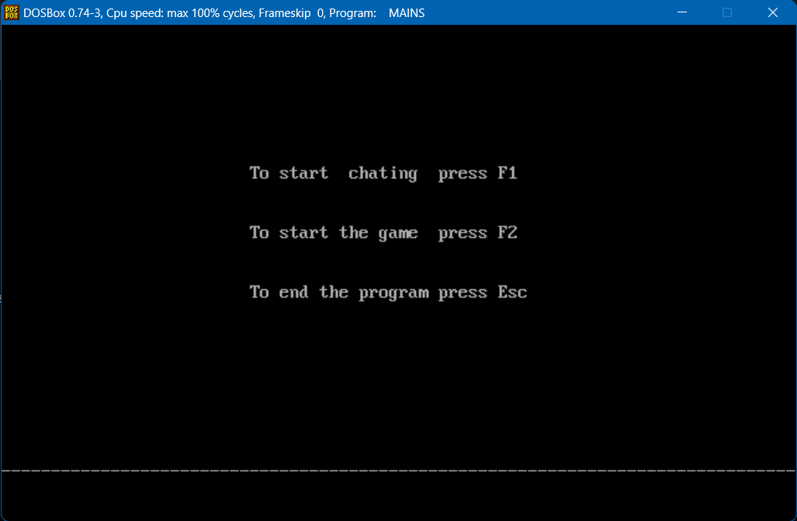
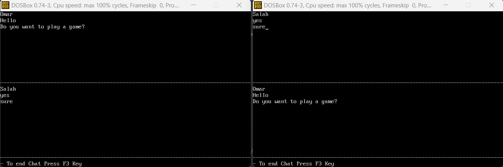
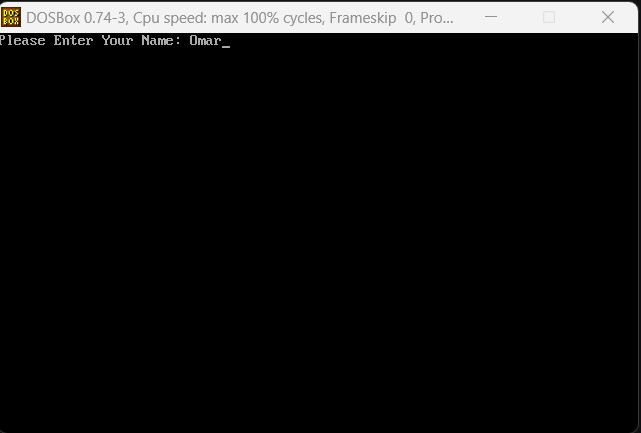
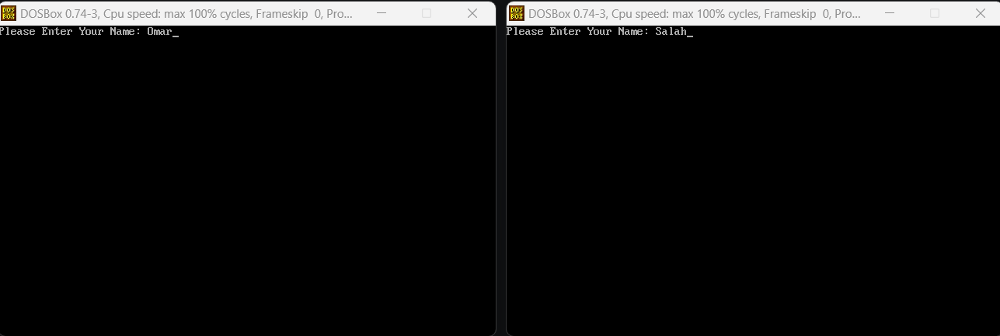
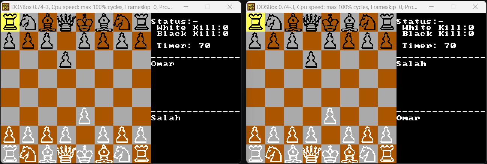
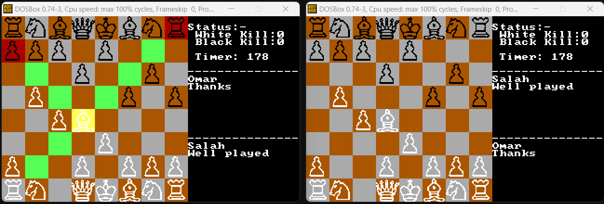
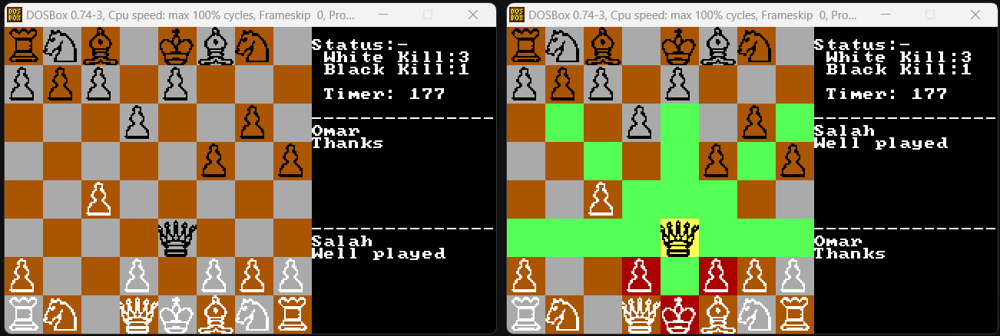
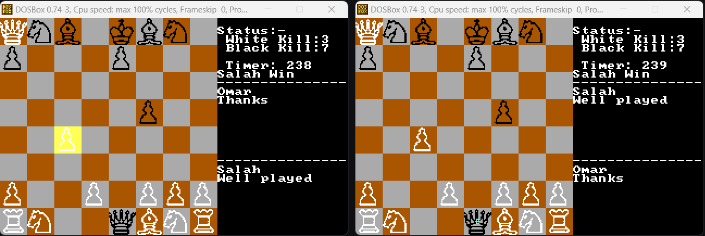

# Chezz-Game-With-Assembly

This game is a modified version of normal chess with special rules, this is assembly implementation for this [android game](https://play.google.com/store/apps/details?id=com.quickbytegames.chezz&pli=1).

## Features
The game uses serial communication between two computers to have the following features:
- Real Time Chatting
- Playing the Chezz Game itself including (inline chatting)

## Screenshots
Main Menu

Real Time Chatting Between Two Players

One Player Sign in View

Two Player Sign in View

Showing Each Player Side View

Playing With Inline Chatting

Highliting White Player Available Moves

Highliting Black Player Available Moves

Announcing the Name Of The Winner and Declaring The Number Of Kills in Each Side

## Game Rules
Game Mode Scenario
1. Users have to define their names to other users.

2. When a user decides to start a chatting session or a new game, (s) he presses F1 (For real time chatting) or F2 (for the chezz game). Thus, the system operates according to these buttons.

3. If a user wishes to quit the program, he/she could press ESC. A quit is only accepted when the user is in the Main screen mode. When one user quits, the program send ESC to the other user.

4. At the beginning of the game:
- The first player (who sent the invitation) should take the white colour, and the other player the black colour.
- Start the game timer.

5. During the game:
- To move a piece, each player will have five keys. (for example, four Arrows and Enter button), When the player presses Enter (click), then the selected piece will be highlighted and highlight all the available moves for this piece.
- Then the player should use navigation arrows to navigate through the available moves of the selected (clicked) piece
- Then the player should press Enter again to move the selected piece to the highlighted positions
- Then a countdown will appear (starts from 3 seconds), while the countdown only this piece will not be able to move.

6. Unlike standard chess games, the winner in this game should kill the king of the other player not checkmate it.

7. There is a powerup that appears randomly on the chessboard, any player who takes this powerup (by moving one of his pieces to this position), will have a smaller countdown for each of his pieces (will start from 2 seconds instead of 3)

8. If the Knight of the player reaches the other side (opponent side), this Knight will be promoted to a Queen.
